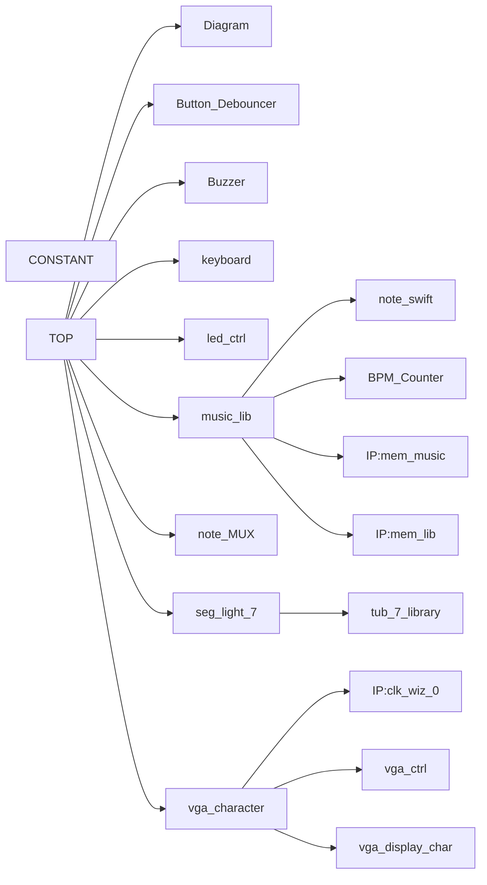

# Digital-Logic-Piano-Project-Documentation

# 零、团队分工

---

### 团队成员与贡献比

> HLC 黄朗初 12213009                37%
XZT 许致韬 12211818                36%
AK   敖恺    12211617                27%
> 

```vhdl
-- TOP                    // HLC XZT AK
-- Button_Debouncer       // HLC
-- Buzzer                 // XZT HLC  
-- keyboard               // XZT HLC
-- led_ctrl               // HLC 
-- note_MUX               // HLC
-- seg_light_7            // HLC
	 -- tub_7_library       // HLC   
-- music_lib              // HLC XZT
	 -- note_swift          // HLC
	 -- BPM_counter         // HLC
	 -- IP: mem_lib         // XZT   
	 -- IP: mem_music       // XZT HLC
-- vga_character          // AK   
   -- IP: clk_wiz_0       // AK
   -- vga_ctrl            // AK
   -- vga_display_char    // AK

项目文档                   // HLC XZT AK
```

# 一、 系统功能列表

---

1. 自由模式：随意按键，电子琴播放相应的音符，例如，随意按下几个按钮，学习机
播放do、re、mi等音符。
2. 学习模式：根据音符顺序和持续时间点亮，以引导用户正确演奏，例如，根据”小
星星”的顺序，应该按灯下方对应的键，用户按下后灯会熄灭，然后打开另
一盏灯。
3. 自动模式：学习机自动演奏歌曲，例如，进入自动演奏模式，自动演奏”小星星”。
4. 设置模式：系统将根据用户的喜好调解键位。
5. VGA:  可以在显示器上显示演奏信息等。

# 二、 系统使用说明

---


### 输入输出端口说明图例（编号如图）

```vhdl
input clk,                  // p17
input rst_n,                // rst button （5）
input U_, D_, L_, R_, C_,   // button input （10、11）
input [7:0] keyboard,       // keyborad input （8）
input [1:0] eight_switch,   // ottava alta / bassa （9）
output [3:0] seg_ena,       // left tub scan   （1、2）
output [7:0] seg_out,       // left tub signal （1、2）
output [3:0] seg_ena_r,     // right tub scan  （3、4）
output [7:0] seg_out_r,     // right tub signal（3、4）
output [7:0] led,           // led control （6，7）
output speaker              // for speaker H17 （0）
output wire vga_hsync,      // Horizontal Sync (12)
output wire vga_vsync,      // Vertical Sync (12)
output wire [3:0] vga_r,    // Red (12)
output wire [3:0] vga_g,    // Green (12)
output wire [3:0] vga_b     // Blue (12)
```

在比特流文件被烧写到开发板后，七段数码管随机显示当前状态（默认为自由模式：FE），显示器显示项目与曲库信息。在按下按键S4或S1后即可切换学习模式、自动模式、设置模式，按下S0按键后进入该模式。再次按下reset建即可回到初始状态。

在不同模式下：

1.自由模式：按reset退出，依照设置模式下的键位按下不同的按键即可发出声音（若未设置按键，则从右到左依次为do,re,mi…la,xi）。同时在显示器上显示用户弹奏的音符，其他模式相同。

2.学习模式：同过S3和S0两个按键即可在曲库中选择乐曲，按下S0按键后即可开始学习。过程为：根据音符顺序和持续时间点亮，以引导用户正确演奏，例如，根据”小星星”的顺序，应该按灯下方对应的键，用户按下后灯会熄灭，然后打开另一盏灯。

3.自动演奏模式：乐曲选择同上，按下S0按键后随即播放。

4.设置模式（尚未上板测试）：设置用户惯用的键位。系统会依次播放标准的do,re,mi…la,xi七个音。在进入模式后，按下单独的按键后在按下S0键就为当前的按键指定了音符（如果有多个按键或重复输入的都不会被系统记录），系统随机播放下一个音符。重复上述步骤直到系统不在播放为止。

# 三、 系统结构说明

---



# 四、子模块功能说明

---

1. constant：用于记录所有使用到的常数
2. Button_Debouncer：用于给按键消抖
3. State_FSM：用于处理不同模式之间的转换
4. seg_light：用于七段数码管显示
5. tub_7_library：用于将四位信号转换为七段数码管的有效输入
6. Buzzer：连接到蜂鸣器，可以播放3个八度的音符
7. keyboard：用于将键盘输入处理为蜂鸣器的输入：
    1. number_of_key用于计算按键在键盘上的位置
    2. key_to_music(lib_mem_gen_0)用于储存按键的位置信息对应的音符
8. note_MUX: 用于处理
9. music_lib: 用于储存音乐的信息：
    1. ip核:mem_lib：（1）演奏速度，（2）第一个音符的储存位置，（3）最后一个音符的储存位置，（4）音乐的得分
    2. ip核:mem_music： 用于储存所有曲子的音符
    3. BPM_counter:：用于处理音乐的不同速度。将系统的时钟信号进行若干次分频后得出合理的节拍
    4. note_swift: 用于处理学习模式与自动模式的并发信号
10. vga_character：使用VGA在显示器上进行文字显示
    
     a. ip核 clk_wiz_0：PLL，用于生成不同频率的像素时钟
    
     b. vga_ctrl:  vga驱动模块，产生行同步和场同步信号
    
     c. vga_display_char:  产生输出的图像数据 
    

# 五、Bonus实现说明

## **1.  用户可以根据他们的使用习惯调整键的位置（尚未上板测试）：**

当学习设备进入调整模式时，设备按顺序演奏音符，如do re mi。选择与’do’相对应的音符后，按下确认按钮，机器将演奏下一个音符，等待用户再次选择并确认。完成所有确认后，用户练习期间按下的键对应的音符将与调整模式一致。


## 2. **VGA显示更多关于音乐的信息以辅助指导演奏和增加趣味性：**

VGA（视频图形阵列）接口体现了数字设计的复杂性和实用性。通过使用VGA标准，项目在显示器上提供了交互式的视觉表示，增强了用户在演奏和选择钢琴曲目时的体验。

### 功能实现：

电子钢琴项目的VGA接口实现了以下核心功能：

- **项目名称显示**：在屏幕中央区域显示项目名称“电子钢琴”。
- **曲库信息显示**：在屏幕左上角显示曲库信息，包括“小星星”和“小步舞曲”两首曲目，为用户提供曲目选择的参考。
- **音符显示**：根据FPGA板上拨码开关的状态，实时在屏幕上显示当前弹奏的音符（do、re、mi、fa、so、la、si），使用户能够直观地看到自己的演奏结果。

### **代码架构：**

1. **顶层模块(`vga_character`)**: 负责将系统时钟、复位信号、状态指示、歌曲编号和键盘输入等信号整合，分配给子模块。同时，它接收子模块生成的RGB信号，输出至VGA接口，完成与显示设备的连接。
2. **控制模块(`vga_ctrl`)**: 负责生成VGA的同步信号（水平同步**`hsync`**和垂直同步**`vsync`**），并根据VGA标准的时序要求控制像素点的渲染时机。它管理着像素坐标的计数器，确保图像数据准确无误地在屏幕上显示。
3. **显示字符模块(`vga_display_char`)**: 用于生成和管理屏幕上显示的字符和图形。根据输入信号的变化，这个模块调整字符数组，实时反映项目名称、曲库信息及当前弹奏的音符。
4. **时钟向导IP核(`clk_wiz_0`)**: 生成25MHz的像素时钟信号(**`vga_clk`**)，匹配480*640@60的分辨率。

### **未来功能展望：**

       由于时间有限，其它尚待完成的功能：音符图形化，动态歌曲名显示，可视化节拍器，音乐波形显示等等。

---

# 六、项目总结

在整个项目开发过程中，我们致力于设计和实现一款具有自由模式、自动演奏模式和学习模式的电子琴学习机。尽管项目取得了一些显著的成果，但我们也经历了一些挑战和学习经验：

1. 项目结构的变更

项目的总体结构经历了多次大量的变更。这反映了我们在不断迭代和优化中对系统设计的深入理解。每次变更都是为了提高系统的灵活性、可维护性和性能。在这个过程中，我们学到了如何在变更中保持项目的一致性和稳定性。

 2.   团队合作

团队合作是项目成功的基石，有效的沟通和协作是我们完成项目的关键。然而，我们在团队成员之间遇到了一些不均衡的情况。这给项目进度和质量带来了一定的影响。在未来的团队合作中，应更加强调每个成员的责任和贡献，确保团队协同效果更佳。

1.  问题解决与学习经验

在开发过程中，我们遇到了一些技术性的问题，如消抖的时限控制和阻塞与非阻塞赋值的混用。通过对这些问题的解决，我们提高了对数字逻辑设计的理解和实践经验。使用仿真工具来调试和定位问题也成为解决技术难题的重要手段。

1.  项目总体经验

尽管在项目的开发过程中面临一些挑战，但通过团队的努力，我们成功地完成了项目。这使我们更加成熟和自信，为未来的项目经验奠定了基础。总的来说，这个项目为我们提供了宝贵的经验，为未来的学习和职业发展奠定了坚实的基础。

# 七、基于ego1可实现的project的想法和建议

使用ego1开发板开发的多功能音频处理器。 利用Ego1的DSP和FPGA资源，开发一个实时音频处理器。能够实现的功能有可编程的节拍器（如同时输出的高音和低音以及在不同演奏区间可以选择不同音符时值）和调音器（读入输入的声音频率进行匹配，输出声音频率与目标音准的差异）等作为基础功能。该项目将涉及到音频信号处理、FPGA编程和实时系统设计。同时可以附带实现混响、均衡器、合成器等功能作为bonus。需要的额外设备有蜂鸣器，振动传感器。

---